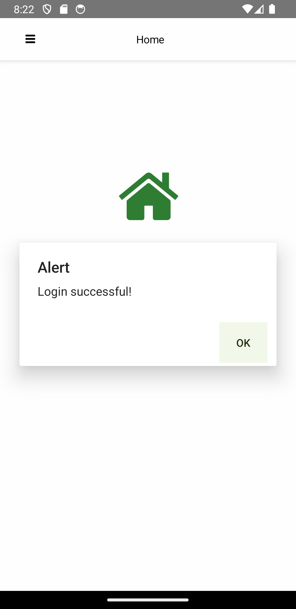
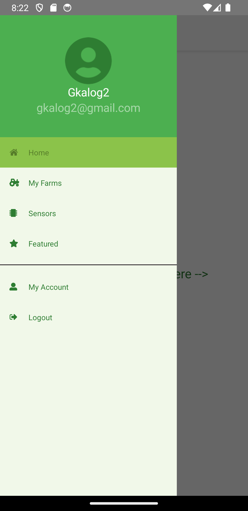
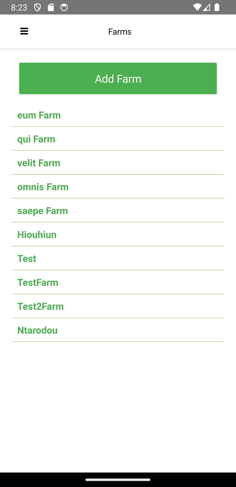
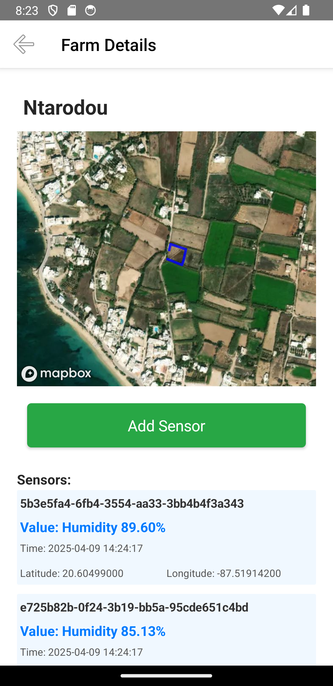
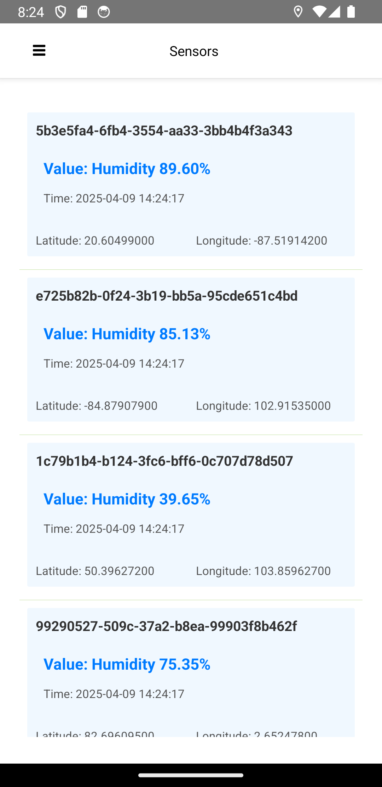
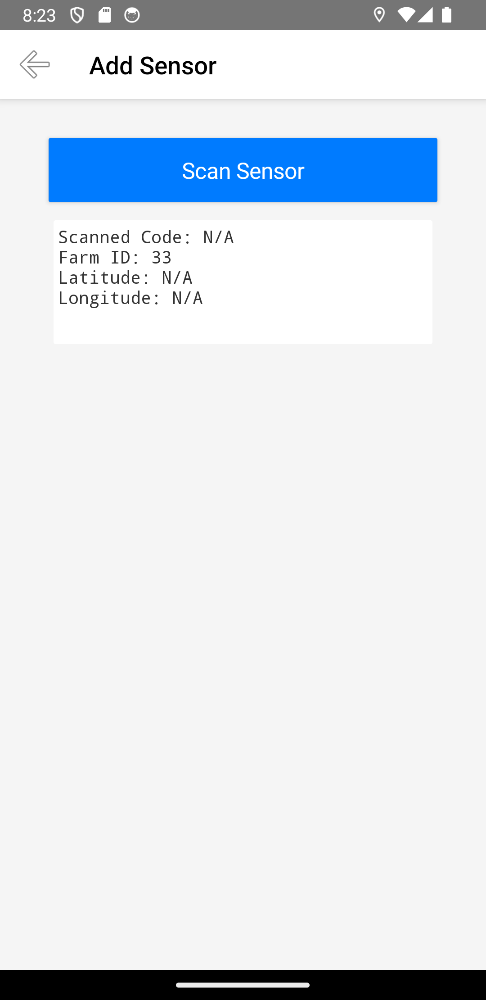
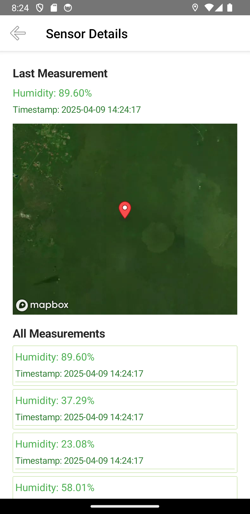
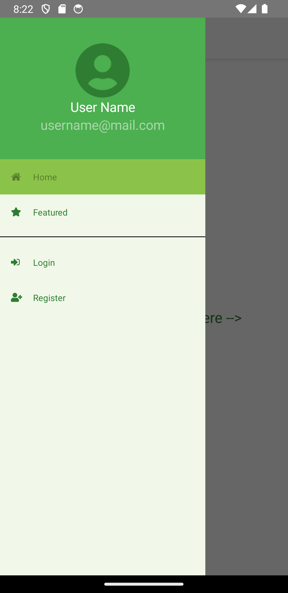

# Συνοδευτικό Κείμενο Εφαρμογής AgroSense

## 1. Εισαγωγή

Η AgroSense είναι μία έξυπνη εφαρμογή αγροτεχνολογίας για Android συσκευές, η οποία έχει ως στόχο την αποδοτική διαχείριση του νερού στις αγροτικές καλλιέργειες, αξιοποιώντας τεχνολογίες IoT και γεωχωρικά δεδομένα. Η εφαρμογή επιτρέπει στους χρήστες να καταγράφουν αγροτεμάχια μέσω GPS, να συνδέουν αισθητήρες υγρασίας μέσω QR code, να λαμβάνουν μετρήσεις σε πραγματικό χρόνο και να παρακολουθούν τα δεδομένα.

Για την εφαρμογή   εκτός από την android εφαρμογή και  το αναγκαίο για τις ανάγκες της backend  για το όποιο επιλέχθηκε να γίνει στο php framework Laravel.
Ο κώδικας  και για τα δυο μέρη της εφαρμογής βρίσκετε στο github

Η εφαρμογή → https://github.com/AgroSensePlatform/agrosenseApp
Το backend → https://github.com/AgroSensePlatform/agrosense-server

## 2. Ανάλυση Λειτουργικών Απαιτήσεων

Η εφαρμογή υποστηρίζει:
- Δημιουργία και διαχείριση λογαριασμού χρήστη.
- Καταγραφή γεωγραφικών αγροτεμαχίων με GPS.
- Εγκατάσταση αισθητήρων υγρασίας μέσω σάρωσης QR κωδικού.
- Υποβολή και αποθήκευση μετρήσεων απο τους αισθητήρες.
- Προβολή δεδομένων μέσω χαρτών και λιστών.
- Διαχείριση λογαριασμού χρήστη.
- Επεκτασιμότητα για πολλαπλούς χρήστες και αισθητήρες.

## 3. Σχεδιασμός Αρχιτεκτονικής

Η αρχιτεκτονική αποτελείται από:
- Backend: Laravel REST API με Sanctum authentication και βάση δεδομένων MySQL.
- Frontend: NativeScript + Vue.js για mobile app.
- Επικοινωνία: HTTPS αιτήσεις από mobile προς API.
- Δεδομένα: Αισθητήρες, μετρήσεις και γεωγραφικά όρια αποθηκεύονται στο backend.

## 4. Υπηρεσίες Backend και Δομή Βάσης Δεδομένων

Το backend της εφαρμογής AgroSense παρέχει RESTful APIs για τη διαχείριση χρηστών, αγροτεμαχίων, αισθητήρων και μετρήσεων. Επίσης, χρησιμοποιεί μια καλά σχεδιασμένη βάση δεδομένων για την αποθήκευση των δεδομένων.

### 4.1 Διαθέσιμα Endpoints

#### Authentication
- `POST /api/register` - Εγγραφή νέου χρήστη.
- `POST /api/login` - Σύνδεση και λήψη authentication token.
- `POST /api/logout` - Αποσύνδεση του συνδεδεμένου χρήστη.
- `GET /api/user` - Λήψη στοιχείων του συνδεδεμένου χρήστη.
- `PUT /api/user` - Ενημέρωση προφίλ χρήστη (π.χ. όνομα, email, κωδικός).
- `DELETE /api/user` - Διαγραφή λογαριασμού χρήστη.

#### Farms
- `GET /api/farms` - Λίστα όλων των αγροτεμαχίων του χρήστη.
- `POST /api/farms` - Δημιουργία νέου αγροτεμαχίου.
- `GET /api/farms/{farm}` - Προβολή συγκεκριμένου αγροτεμαχίου.
- `PUT /api/farms/{farm}` - Ενημέρωση συγκεκριμένου αγροτεμαχίου.
- `DELETE /api/farms/{farm}` - Διαγραφή συγκεκριμένου αγροτεμαχίου.
- `GET /api/farms/{farm}/sensors` - Λίστα αισθητήρων για συγκεκριμένο αγροτεμάχιο.

#### Sensors
- `GET /api/sensors` - Λίστα όλων των αισθητήρων του χρήστη.
- `POST /api/sensors` - Προσθήκη νέου αισθητήρα.
- `POST /api/sensors/scan` - Δημιουργία ή ενημέρωση αισθητήρα μέσω QR code.
- `GET /api/sensors/{sensor}` - Προβολή συγκεκριμένου αισθητήρα με τις μετρήσεις του.
- `PUT /api/sensors/{sensor}` - Ενημέρωση συγκεκριμένου αισθητήρα.
- `DELETE /api/sensors/{sensor}` - Διαγραφή συγκεκριμένου αισθητήρα.

#### Measurements
- `POST /api/measurements` - Καταχώρηση μέτρησης από αισθητήρα.

---

### 4.2 Δομή Βάσης Δεδομένων

#### Users
| Στήλη              | Τύπος       | Περιγραφή                     |
|---------------------|------------|-------------------------------|
| id                 | BIGINT     | Πρωτεύον κλειδί               |
| name               | STRING     | Όνομα χρήστη                  |
| email              | STRING     | Email χρήστη (μοναδικό)       |
| password           | STRING     | Κρυπτογραφημένος κωδικός       |
| email_verified_at  | TIMESTAMP  | Χρόνος επιβεβαίωσης email      |
| remember_token     | STRING     | Token για "remember me"       |
| timestamps         | TIMESTAMP  | Χρόνοι δημιουργίας/ενημέρωσης |

#### Farms
| Στήλη              | Τύπος       | Περιγραφή                     |
|---------------------|------------|-------------------------------|
| id                 | BIGINT     | Πρωτεύον κλειδί               |
| user_id            | BIGINT     | Ξένο κλειδί προς τον πίνακα `users` |
| name               | STRING     | Όνομα αγροτεμαχίου            |
| coordinates        | JSON       | Συντεταγμένες GPS αγροτεμαχίου |
| timestamps         | TIMESTAMP  | Χρόνοι δημιουργίας/ενημέρωσης |

#### Sensors
| Στήλη              | Τύπος       | Περιγραφή                     |
|---------------------|------------|-------------------------------|
| id                 | BIGINT     | Πρωτεύον κλειδί               |
| user_id            | BIGINT     | Ξένο κλειδί προς τον πίνακα `users` |
| farm_id            | BIGINT     | Ξένο κλειδί προς τον πίνακα `farms` |
| code               | STRING     | Μοναδικός κωδικός αισθητήρα   |
| lat                | DECIMAL    | Γεωγραφικό πλάτος αισθητήρα    |
| lon                | DECIMAL    | Γεωγραφικό μήκος αισθητήρα     |
| timestamps         | TIMESTAMP  | Χρόνοι δημιουργίας/ενημέρωσης |

#### Measurements
| Στήλη              | Τύπος       | Περιγραφή                     |
|---------------------|------------|-------------------------------|
| id                 | BIGINT     | Πρωτεύον κλειδί               |
| sensor_id          | BIGINT     | Ξένο κλειδί προς τον πίνακα `sensors` |
| humidity           | DECIMAL    | Τιμή υγρασίας (0-100%)        |
| timestamp          | TIMESTAMP  | Χρόνος μέτρησης               |
| timestamps         | TIMESTAMP  | Χρόνοι δημιουργίας/ενημέρωσης |

---

## 5. Τεχνολογίες και Λειτουργίες που Υλοποιεί η Εφαρμογή

Η εφαρμογή AgroSense υλοποιεί τις παρακάτω τεχνολογίες και λειτουργίες:

### Τεχνολογίες
- **Web Services (REST API):** Επικοινωνία μεταξύ της εφαρμογής και του backend μέσω RESTful APIs.
- **Sensor Technology:** Χρήση GPS της συσκευής για την καταγραφή γεωγραφικών δεδομένων.
- **QR Coding:** Σάρωση αισθητήρων με χρήση κάμερας για την καταχώρηση και ενημέρωσή τους.
- **Access to Phone Resources:** Πρόσβαση σε πόρους της συσκευής, όπως η κάμερα, για την υποστήριξη λειτουργιών  της εφαρμογής.

### Λειτουργίες
- **Συνδεσιμότητα στο Διαδίκτυο μέσω API:** Επικοινωνία της εφαρμογής με το backend για την αποστολή και λήψη δεδομένων.
- **Επίγνωση Θέσης:** Χρήση GPS για την καταγραφή γεωγραφικών αγροτεμαχίων.
- **CRUD Λειτουργίες:** Δημιουργία, ανάγνωση, ενημέρωση και διαγραφή δεδομένων (χρηστών, αγροτεμαχίων, αισθητήρων, μετρήσεων).
- **Διαχείριση Αισθητήρων:** Καταχώρηση αισθητήρων μέσω QR κωδικών και παρακολούθηση των δεδομένων τους.
- **Προβολή Δεδομένων:** Εμφάνιση δεδομένων μέσω χαρτών και λιστών για εύκολη παρακολούθηση.
- **Διαχείριση Λογαριασμού Χρήστη:** Δημιουργία, ενημέρωση και διαγραφή λογαριασμών χρηστών.

## 6. Screenshots Εφαρμογής

Εικόνα 1 – Οθόνη Σύνδεσης

Εικόνα 2 – Επιτυχής Σύνδεση

Εικόνα 3 – Πλευρικό Μενού Συνδεδεμενου χρηστη

Εικόνα 4 – Λίστα Αγροτεμαχίων

Εικόνα 5 – Εμφάνιση Αγροτεμαχίου με τους αισθητηρες του

Εικόνα 6 – Λιστα αισθητήρων

Εικόνα 7 – Καταχώρηση αισθητήρα πριν την σαρωση του QrCode

Εικόνα 8 – Καταχώρηση αισθητήρα μετα την σαρωση του QrCode

Εικόνα 9 – Λιστα αισθητήρων με τον αισθητηρα που σαρωθηκε

Εικόνα 10 – Εμφάνιση  Αισθητηρα  στο χαρτη με τις μετρησεις του

Εικόνα 11 – Πλευρικο μενου χωρις να εχει κανει login ο χρηστης

## 7. Παραδείγματα Κώδικα από την Εφαρμογή

Παρακάτω παρατίθενται σύνδεσμοι προς τα βασικά components της εφαρμογής στο GitHub repository:

- [Αντικείμενο Διαχείρισης Token](https://github.com/AgroSensePlatform/agrosenseApp/blob/main/app/shared/auth-service.js) (https://github.com/AgroSensePlatform/agrosenseApp/blob/main/app/shared/auth-service.js)
- [Login Χρήστη](https://github.com/AgroSensePlatform/agrosenseApp/blob/main/app/components/Login.vue) (https://github.com/AgroSensePlatform/agrosenseApp/blob/main/app/components/Login.vue)
- [Register Χρήστη](https://github.com/AgroSensePlatform/agrosenseApp/blob/main/app/components/Register.vue) (https://github.com/AgroSensePlatform/agrosenseApp/blob/main/app/components/Register.vue)
- [Προσθήκη Αγροτεμαχίου](https://github.com/AgroSensePlatform/agrosenseApp/blob/main/app/components/Farm/AddFarm.vue) (https://github.com/AgroSensePlatform/agrosenseApp/blob/main/app/components/Farm/AddFarm.vue)
- [Προσθήκη Αισθητήρα](https://github.com/AgroSensePlatform/agrosenseApp/blob/main/app/components/Sensor/AddSensor.vue) (https://github.com/AgroSensePlatform/agrosenseApp/blob/main/app/components/Sensor/AddSensor.vue)

## 8. Παράδειγμα Σεναρίου Χρήσης
Ο Γιώργος είναι ένας νέος αγρότης που θέλει να παρακολουθεί την υγρασία του εδάφους στα χωράφια του ώστε να βελτιώσει την άρδευση και να μειώσει τη σπατάλη νερού.

1. **Εγγραφή και Σύνδεση:**
   Ο Γιώργος ανοίγει την εφαρμογή AgroSense, δημιουργεί λογαριασμό με το email του και συνδέεται.

2. **Καταγραφή Αγροτεμαχίου:**
   Περπατώντας γύρω από το χωράφι του, χρησιμοποιεί την εφαρμογή για να ορίσει τα όρια του αγροτεμαχίου με τη χρήση του GPS της κινητής συσκευής του.

3. **Τοποθέτηση Αισθητήρων:**
   Ο Γιώργος τοποθετεί έναν-έναν τους αισθητήρες υγρασίας στα σημεία που τον ενδιαφέρουν περισσότερο να παρακολουθεί την υγρασία του εδάφους (π.χ. άκρες, μέση, χαμηλά σημεία).

4. **Καταγραφή Θέσης και QR Σάρωση:**
   Κάθε φορά που τοποθετεί έναν αισθητήρα, χρησιμοποιεί την εφαρμογή για να σαρώσει τον QR κωδικό του αισθητήρα. Την ώρα της σάρωσης, η εφαρμογή χρησιμοποιεί το GPS του κινητού για να καταγράψει τη γεωγραφική του θέση και να τον αντιστοιχίσει στο αγροτεμάχιο.

5. **Λήψη Μετρήσεων:**
   Οι αισθητήρες αρχίζουν να στέλνουν μετρήσεις υγρασίας στο backend και ο Γιώργος μπορεί να τις δει στην εφαρμογή σε πραγματικό χρόνο.

6. **Ανάλυση Δεδομένων:**
   Μέσα από την ενότητα ιστορικού, ο Γιώργος μπορεί να δει διαγράμματα με τις τιμές υγρασίας ανά αισθητήρα και να εντοπίσει πότε και πού χρειάζεται άρδευση.

7. **Διαχείριση και Ασφάλεια:**
   Τέλος, ο Γιώργος μπορεί να επεξεργαστεί τα στοιχεία του λογαριασμού του και να αποσυνδεθεί με ασφάλεια.

## 9. Προτάσεις για Μελλοντικές Βελτιώσεις – Μετατροπή της Εφαρμογής σε Κυβερνοφυσικό Σύστημα / IoT Εφαρμογή στον Τομέα της Γεωργίας

Η εφαρμογή AgroSense αποτελεί μια λειτουργική και επεκτάσιμη λύση για την καταγραφή και παρακολούθηση δεδομένων υγρασίας σε αγροτεμάχια μέσω κινητής συσκευής. Παρ’ όλα αυτά, υπάρχουν σημαντικές δυνατότητες για μελλοντικές επεκτάσεις και βελτιώσεις που θα ενισχύσουν τη λειτουργικότητα, την αποδοτικότητα και την εμπειρία χρήστη.

**1. Υιοθέτηση βάσης δεδομένων InfluxDB για time-series δεδομένα**

Στην τρέχουσα υλοποίηση, τα δεδομένα αποθηκεύονται σε MySQL. Ωστόσο, για την αποδοτική αποθήκευση και ανάλυση χρονικών σειρών δεδομένων όπως οι μετρήσεις υγρασίας, προτείνεται η ενσωμάτωση της **InfluxDB**, μιας βάσης δεδομένων βελτιστοποιημένης για time-series δεδομένα. Η χρήση της InfluxDB θα επιτρέψει:
- Άμεση αποθήκευση μετρήσεων με timestamps.
- Γρήγορη ανάκτηση ιστορικών δεδομένων ανά αισθητήρα.
- Ενσωματωμένες δυνατότητες επεξεργασίας δεδομένων (π.χ. μέσοι όροι, trends).
- Οπτικοποίηση μέσω εργαλείων όπως το Grafana.

**2. Χρήση MQTT για τη Μετάδοση Δεδομένων Αισθητήρων**

Αντί οι αισθητήρες να στέλνουν δεδομένα απευθείας στο backend μέσω HTTP, μπορεί να χρησιμοποιηθεί το πρωτόκολλο **MQTT** για την ελαφριά και αξιόπιστη μετάδοση δεδομένων. Οι αισθητήρες θα δημοσιεύουν σε έναν MQTT broker και:
- Το backend θα λειτουργεί ως subscriber για σκοπούς αποθήκευσης και ανάλυσης.
- Η Android εφαρμογή θα λαμβάνει ως subscriber τα δεδομένα σε πραγματικό χρόνο.
- Η βάση InfluxDB θα ενημερώνεται αυτόματα μέσω κάποιου service που και αυτο θα ειναι  subscriber στο καναλι του mqtt broker.

Αυτό το μοντέλο μειώνει το φορτίο του backend και προσφέρει real-time ροή δεδομένων με χαμηλή κατανάλωση πόρων.

**3. Ονομασία Αισθητήρων**

Προτείνεται η δυνατότητα προαιρετικής ονομασίας κάθε αισθητήρα από τον χρήστη. Για παράδειγμα: “Αισθητήρας Βόρειας Πλευράς”. Αυτό προσφέρει καλύτερη αναγνωσιμότητα και ευκολία στη διαχείριση αισθητήρων σε αγροκτήματα με πολλαπλά σημεία παρακολούθησης.

**4. Συσχέτιση Καλλιεργήσιμου Είδους με Αγροτεμάχια και Αισθητήρες**

Κάθε αγροτεμάχιο θα μπορούσε να έχει καθορισμένο **καλλιεργήσιμο είδος** (π.χ. βαμβάκι, ελιές), το οποίο θα περιλαμβάνει προκαθορισμένα όρια υγρασίας. Σε αγροκτήματα με μικτές καλλιέργειες, το καλλιεργήσιμο είδος θα μπορούσε να ορίζεται ξεχωριστά για κάθε αισθητήρα. Με αυτό τον τρόπο, η εφαρμογή θα μπορεί να παρέχει στοχευμένες ειδοποιήσεις ή συστάσεις.

**5. Δημιουργία Web Dashboard**

Προτείνεται η ανάπτυξη μιας πλήρους  web εφαρμογής (dashboard) για χρήση από υπολογιστή, χρησιμοποιώντας το υπάρχον Laravel backend. Το dashboard θα προσφέρει:
- Διαδραστικούς χάρτες και γραφήματα.
- Επεξεργασία αγροτεμαχίων, αισθητήρων και καλλιεργειών.
- Ρυθμίσεις ειδοποιήσεων και παρακολούθηση ιστορικών δεδομένων.
- Υποστήριξη για αγρότες με μεγαλύτερες υποδομές ή πολλαπλές εκμεταλλεύσεις.

** 6. Βελτίωση Ασφάλειας στη Μετάδοση Δεδομένων από Αισθητήρες**

Στην τρέχουσα υλοποίηση, οι αισθητήρες αποστέλλουν δεδομένα στο backend χρησιμοποιώντας μόνο τον μοναδικό κωδικό τους, ο οποίος είναι φανερός. Αυτό δημιουργεί ένα κενό ασφαλείας, καθώς κάποιος κακόβουλος χρήστης θα μπορούσε να υποκλέψει τον κωδικό και να αποστείλει ψευδή δεδομένα.

Προτείνεται η υλοποίηση ενός συστήματος ασφαλούς αυθεντικοποίησης αισθητήρων, το οποίο θα περιλαμβάνει τα εξής βήματα:

1. **Αίτηση Token από τον Αισθητήρα:**
   - Ο αισθητήρας, κατά την αρχική του ενεργοποίηση, θα αιτείται ένα μοναδικό token από το backend.
   - Το token αυτό θα αποθηκεύεται στη μνήμη του αισθητήρα και θα χρησιμοποιείται για όλες τις μελλοντικές επικοινωνίες.

2. **Έγκριση Token από τον Χρήστη:**
   - Το backend θα αποστέλλει μια ειδοποίηση (notification) στον χρήστη, ζητώντας την έγκρισή του για την απόδοση του token στον αισθητήρα.
   - Ο χρήστης θα μπορεί να εγκρίνει ή να απορρίψει την αίτηση μέσω της εφαρμογής.

3. **Επαλήθευση Token:**
   - Κάθε φορά που ο αισθητήρας αποστέλλει δεδομένα, το backend θα επαληθεύει το token για να διασφαλίσει ότι τα δεδομένα προέρχονται από εξουσιοδοτημένη συσκευή.

Αυτό το σύστημα θα ενισχύσει την ασφάλεια της εφαρμογής, αποτρέποντας μη εξουσιοδοτημένη πρόσβαση και διασφαλίζοντας την ακεραιότητα των δεδομένων που αποστέλλονται από τους αισθητήρες.

**7. Υλοποίηση Φυσικών Αισθητήρων και Δικτύωσης για Μετατροπή σε Κυβερνοφυσικό Σύστημα**

Προτείνεται η δημιουργία φυσικών αισθητήρων πεδίου βασισμένων σε ESP32, με σκοπό τη συλλογή πραγματικών δεδομένων από το περιβάλλον και την αποστολή τους στο υπάρχον backend σύστημα. Κάθε αισθητήρας μπορεί να περιλαμβάνει:

Αισθητήρα υγρασίας εδάφους (Soil Hygrometer / Moisture Detection Module),

Αισθητήρα θερμοκρασίας και υγρασίας περιβάλλοντος (τύπου DHT11 ή DHT22),

Φωτοαισθητήρα για καταγραφή της έντασης φωτός.

Για τη δικτύωση των αισθητήρων προτείνονται δύο τύποι:

**Wi-Fi** αισθητήρες, που χρησιμοποιούν την ενσωματωμένη δυνατότητα σύνδεσης του ESP32,

**LPWAN** ισθητήρες, με χρήση τεχνολογιών όπως LoRa για περιοχές χωρίς κάλυψη Wi-Fi.

Η αποστολή των δεδομένων θα γίνεται περιοδικά, είτε μέσω HTTP είτε μέσω MQTT, ανάλογα με το πρωτόκολλο που θα υλοποιηθεί, επιτρέποντας την πλήρη ενσωμάτωσή τους στο σύστημα AgroSense και τη μετατροπή του σε ένα ολοκληρωμένο Κυβερνοφυσικό Σύστημα IoT για τη γεωργία.

