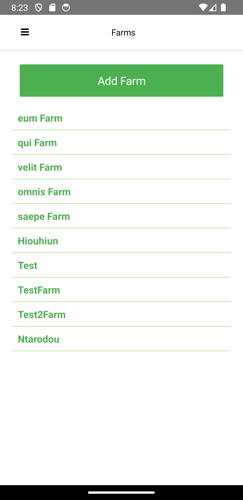
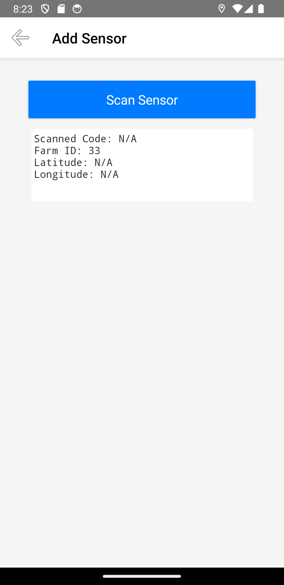
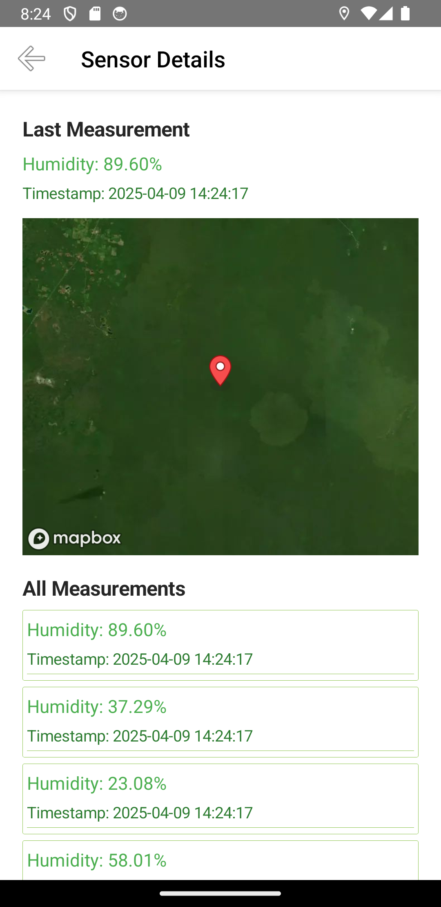

# Συνοδευτικό Κείμενο Εφαρμογής AgroSense

## 1. Εισαγωγή

Η AgroSense είναι μία έξυπνη εφαρμογή αγροτεχνολογίας για Android συσκευές, η οποία έχει ως στόχο την αποδοτική διαχείριση του νερού στις αγροτικές καλλιέργειες, αξιοποιώντας τεχνολογίες IoT και γεωχωρικά δεδομένα. Η εφαρμογή επιτρέπει στους χρήστες να καταγράφουν αγροτεμάχια μέσω GPS, να συνδέουν αισθητήρες υγρασίας μέσω QR code, να λαμβάνουν μετρήσεις σε πραγματικό χρόνο και να παρακολουθούν τα δεδομένα.

## 2. Ανάλυση Λειτουργικών Απαιτήσεων

Η εφαρμογή υποστηρίζει:
- Δημιουργία και διαχείριση λογαριασμού χρήστη.
- Καταγραφή γεωγραφικών αγροτεμαχίων με GPS.
- Εγκατάσταση αισθητήρων υγρασίας μέσω σάρωσης QR κωδικού.
- Υποβολή και αποθήκευση μετρήσεων.
- Προβολή δεδομένων μέσω χαρτών και λιστών.
- Διαχείριση λογαριασμού χρήστη.
- Επεκτασιμότητα για πολλαπλούς χρήστες και αισθητήρες.

## 3. Σχεδιασμός Αρχιτεκτονικής

Η αρχιτεκτονική αποτελείται από:
- Backend: Laravel REST API με Sanctum authentication και βάση δεδομένων MySQL.
- Frontend: NativeScript + Vue.js για mobile app.
- Επικοινωνία: HTTPS αιτήσεις από mobile προς API.
- Δεδομένα: Αισθητήρες, μετρήσεις και γεωγραφικά όρια αποθηκεύονται στο backend.

## 4. Υλοποίηση Τεχνολογιών

Η εφαρμογή υλοποιεί:
- Συνδεσιμότητα στο Διαδίκτυο μέσω API.
- Επίγνωση θέσης με χρήση GPS αισθητήρα κινητού.
- CRUD λειτουργίες με αποθήκευση σε βάση δεδομένων.
- RESTful endpoints για διαχείριση: χρηστών, farms, sensors, measurements.

Ενδεικτικά Endpoints:

- - POST /api/register
- - POST /api/login
- - POST /api/farms
- - POST /api/sensors/scan
- - POST /api/measurements
## 5. Υλοποίηση Τεχνολογιών Επιλογής

Υποστηρίζονται οι εξής τεχνολογίες:
- Web Services (REST API)
- Sensor Technology: GPS συσκευής
- QR Coding: σάρωση αισθητήρων με χρήση κάμερας
- Access to Phone Resources: πρόσβαση σε κάμερα κινητού

## 6. Screenshots Εφαρμογής

Εικόνα 1 – Οθόνη Σύνδεσης

Εικόνα 2 – Επιτυχής Σύνδεση

Εικόνα 3 – Πλευρικό Μενού Συνδεδεμενου χρηστη

Εικόνα 4 – Λίστα Αγροτεμαχίων

Εικόνα 5 – Εμφάνιση Αγροτεμαχίου με τους αισθητηρες του

Εικόνα 6 – Λιστα αισθητήρων

Εικόνα 7 – Καταχώρηση αισθητήρα

Εικόνα 8 – Εμφάνιση  Αισθητηρα  στο χαρτη με τις μετρησεις του

Εικόνα 9 – Πλευρικο μενου χωρις να εχει κανει login ο χρηστης

## 7. Παραδείγματα Κώδικα από την Εφαρμογή

Παρακάτω παρατίθενται σύνδεσμοι προς τα βασικά components της εφαρμογής στο GitHub repository:

- [Αντικείμενο Διαχείρισης Token](https://github.com/AgroSensePlatform/agrosenseApp/blob/main/app/shared/auth-service.js)
- [Login Χρήστη](https://github.com/AgroSensePlatform/agrosenseApp/blob/main/app/components/Login.vue)
- [Register Χρήστη](https://github.com/AgroSensePlatform/agrosenseApp/blob/main/app/components/Register.vue)
- [Προσθήκη Αγροτεμαχίου](https://github.com/AgroSensePlatform/agrosenseApp/blob/main/app/components/Farm/AddFarm.vue)
- [Προσθήκη Αισθητήρα](https://github.com/AgroSensePlatform/agrosenseApp/blob/main/app/components/Sensor/AddSensor.vue)

